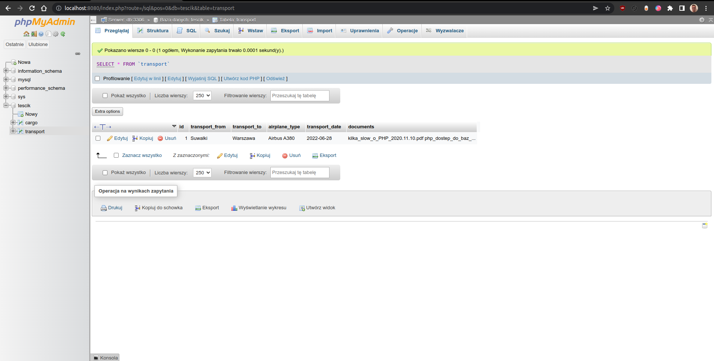

# Recruitment task in php using mvc model

It consists of the following:

* PHP
* Nginx
* MySQL
* phpMyAdmin

Document files from form upload are stored in storage/documents/{transportDate}/{id}

## Installation

* Clone this repository on your local computer
* Configure .env as needed
* Install composer
* Run `composer install`
* Run the `docker-compose up -d`.
* Give permissions in php container to folder /var/storage/documents

```shell
git clone https://github.com/Pawebf1/sam-php-mvc.git
cd sam-php-mvc
cp sample.env .env
composer install
sudo docker-compose up -d
sudo docker exec project_php_1 bash -c "cd .. ; cd storage; chmod 777 documents/"
// visit localhost
```

## Screenshots





## Possible exceptions


